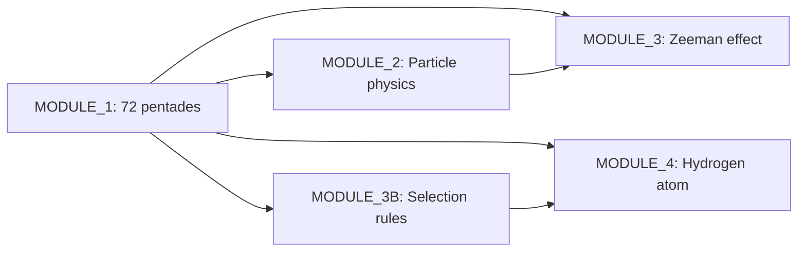

# `pentadic-modules` – Pentadic Theory Computational Framework

This folder contains the core Python modules implementing the **pentadic model** based on Clifford algebras $\text{Cl}(6,0)$ and $\text{Cl}(6,6)$. These scripts provide the mathematical foundation for describing elementary particles, atomic transitions, and Zeeman effects through angular rearrangements of 72 fundamental pentads.

All modules are designed to be run independently and produce JSON reports, figures, and validation summaries.

---

## Prerequisites

- Python ≥ 3.8
- Required packages: `numpy`, `scipy`, `dataclasses`, `typing`, `json`, `math`, `gzip`
- High-precision arithmetic via `decimal` module (50-digit precision configured)

---

## Module Architecture

```
pentadic-modules/
├── MODULE_1_72_pentades.py                    # Foundation: 72 pentades construction
├── MODULE_2_PHYSIQUE_DES_PARTICULES...py      # Particle physics layer
├── MODULE_3_EFFET_ZEEMAN_PENTADIQUE_BOTT.py   # Zeeman effect + uncertainty propagation
├── MODULE_3B_RÈGLES_DE_SÉLECTION...py         # Selection rules for transitions
└── MODULE_4_ATOME_D_HYDROGÈNE_COMPLET_BOTT.py # Complete hydrogen atom model
```

---

## Scripts Overview

### 1. `MODULE_1_72_pentades.py`
**Foundation: Construction of the 72 Fundamental Pentades**

Implements the complete set of 72 pentades derived from $\text{Cl}(6,0)$:
- **6 families** (FI–FVI): direct, fire-water exchange, dual, dual-exchange, space-space, charge-charge
- **6 structural patterns** per family with permutations
- **Yang/Yin symmetry**: 36 positive-sign + 36 negative-sign pentades
- **Rowlands duality**: strict and extended patterns with complete fire/water inversion for dual families

**Key features:**
- Validation of all 6 generators $(i,j,k,I,J,K)$ presence in each pentade
- Export to `pentades_72_finales.json` with full metadata
- Automated tests: counting, validity, Yang/Yin balance, family distribution, duality verification

**Output:** `pentades_72_finales.json` (72 validated pentades with structure, fire, water, sign, family, generators)

**Usage:**
```bash
python MODULE_1_72_pentades.py
```

---

### 2. `MODULE_2_PHYSIQUE_DES_PARTICULES_DANS_LE_MODÈLE_PENTADIQUE.py`
**Particle Physics Layer: Standard Model in Pentadic Representation**

Maps all Standard Model particles onto the 72-pentade framework:
- **Leptons** (e⁻, μ⁻, τ⁻, νₑ, ν_μ, ν_τ) with family FI assignments
- **Quarks** (u, d, c, s, t, b) with color degrees of freedom
- **Gauge bosons** (γ, g, W⁺, W⁻, Z⁰) in families FV–FVI
- **Hadrons** (p, n, π⁺, π⁻, π⁰) as composite states

**Calculations:**
- Pentadic mass formula: $m = m_0 \times N_\text{charge} \times f_\text{family} \times f_\text{gen} \times f_\text{color} \times f_\text{spin}$
- Gyromagnetic factor $g$ with QED corrections: $g = 2(1 + \alpha/2\pi)$
- Magnetic moments in Bohr magnetons
- Weak transition validation (charge, lepton number conservation)
- CKM and PMNS mixing matrices

**Output:** `particules_modele_standard.json`, `transitions_faibles.json`, console validation report

**Usage:**
```bash
python MODULE_2_PHYSIQUE_DES_PARTICULES_DANS_LE_MODÈLE_PENTADIQUE.py
```

---

### 3. `MODULE_3_EFFET_ZEEMAN_PENTADIQUE_BOTT.py`
**Pentadic Zeeman Effect with High-Precision Uncertainty Propagation**

Computes Zeeman splittings within the pentadic framework, incorporating:
- **CODATA 2018/2022 + PDG constants** with 50-digit `Decimal` precision
- **Monte Carlo uncertainty propagation** (50,000 samples) for $\mu_B$, $g$-factors, masses
- **Relative tolerance comparison** (adaptive: 1% for e⁻, 5% for p, 10% for n) vs. NIST reference values
- **Bott periodicity integration**: dimension-72 lattice coupling corrections

**Key classes:**
- `ResultatAvecIncertitude`: result + uncertainty + confidence interval
- `propagation_monte_carlo()`: generic uncertainty propagation engine
- `comparer_avec_tolerance_relative()`: adaptive validation metric

**Output:** `zeeman_pentadique_avec_incertitudes.json`, console report with compatibility status

**Usage:**
```bash
python MODULE_3_EFFET_ZEEMAN_PENTADIQUE_BOTT.py
```

---

### 4. `MODULE_3B_RÈGLES_DE_SÉLECTION_TRANSITIONS_PENTADIQUES_BOTT.py`
**Selection Rules for Pentadic Atomic Transitions**

Formalizes transition rules without explicit spin vectors, using pentadic structure alone:

**Conservation laws:**
- Generator set conservation (6 generators invariant)
- Charge conservation via $I,J,K$ counting in bivectors/fire/water
- Angular momentum: $\Delta l = \pm1$ (E1), $\Delta l = 0$ (M1), $\Delta l = \pm2$ (E2)
- Parity: $(-1)^l$ inversion for electric dipole transitions

**Pentadic-specific rules:**
- Minimal bivector change: ≤2 structure elements may differ between initial/final pentades
- Forbidden: transitions to identical quantum states $(n,l,m_l)$
- Intensity hierarchy: E1 (1.0) > M1 (0.01) > E2 (0.001)

**Zeeman module:**
- Level splitting for $l=0,1$ states in external $B$-field
- Polarization rules: $\pi$ ($\Delta m_l=0$), $\sigma^\pm$ ($\Delta m_l=\pm1$)
- Relative intensity normalization

**Output:** `regles_selection_resultats.json` with validated transitions and Zeeman patterns

**Usage:**
```bash
python MODULE_3B_RÈGLES_DE_SÉLECTION_TRANSITIONS_PENTADIQUES_BOTT.py
```

---

### 5. `MODULE_4_ATOME_D_HYDROGÈNE_COMPLET_BOTT.py`
**Complete Pentadic Hydrogen Atom Model (n=1–10)**

Full quantum-state enumeration with all QED corrections:

**Energy components:**
1. **Bohr energy**: $E_n = -R_\infty \mu / n^2$
2. **Fine structure**: $\alpha^2$ relativistic + spin-orbit coupling
3. **Lamb shift**: Bethe logarithms for $n=1$–$10$, $l=0,1$ (full table included)
4. **Hyperfine structure**: $A_{1S} = 1.420\,405\,751\,768\,\text{GHz}$, all $F$ states
5. **Zeeman term**: optional external $B$-field coupling

**Features:**
- State class `EtatQuantiquePentadique` with pentade + quantum numbers $(n,l,j,m_j,F,m_F)$
- Automatic generation of all allowed states up to $n_\text{max}=10$ (~2,000 states)
- Transition enumeration with $\Delta l = \pm1$ selection rule
- **File compression**: transitions exported as `.json.gz` (9-level gzip)
- Series identification: Lyman, Balmer, Paschen, Brackett, Pfund, Humphreys

**Output:**
- `hydrogene_pentadique_niveaux.json` (~5 MB, all states)
- `hydrogene_pentadique_transitions.json.gz` (~1 MB, compressed transitions)

**Usage:**
```bash
python MODULE_4_ATOME_D_HYDROGÈNE_COMPLET_BOTT.py
# Optional: adjust n_max or disable compression
python MODULE_4_ATOME_D_HYDROGÈNE_COMPLET_BOTT.py --n_max=15 --no-compress
```

---

## Execution Workflow



**Recommended order:**
1. Run `MODULE_1` first to generate `pentades_72_finales.json`
2. Execute `MODULE_2` for particle validation and mass predictions
3. Use `MODULE_3` for Zeeman splitting benchmarks against NIST
4. Apply `MODULE_3B` to filter allowed atomic transitions
5. Deploy `MODULE_4` for complete hydrogen spectroscopy predictions

---

## Data Flow & Outputs

| Module | Primary Output | Size | Key Metrics |
|--------|---------------|------|-------------|
| MODULE_1 | `pentades_72_finales.json` | ~50 KB | 72 validated pentades, 6 families |
| MODULE_2 | `particules_modele_standard.json` | ~20 KB | 22 particles, mass/g-factor validation |
| MODULE_3 | `zeeman_pentadique_avec_incertitudes.json` | ~5 KB | e⁻/p/n splittings ± Monte Carlo uncertainty |
| MODULE_3B | `regles_selection_resultats.json` | ~10 KB | Transition rules, Zeeman polarizations |
| MODULE_4 | `hydrogene_*_niveaux.json` + `.json.gz` | ~6 MB total | ~2,000 states, ~500 transitions (n≤10) |

---

## Theoretical Context

These modules implement the framework described in *Transitions Angulaires entre Particules* (De Dominicis, 2026):
- Particles = stable angular configurations in the Ibozoo Uû network
- Transitions = geometric rearrangements of pentadic angles
- Clifford algebra $\text{Cl}(6,6)$ provides the pre-geometric substrate
- Fire/water duality encodes weak interaction and mass/charge separation

For mathematical details, see the accompanying publication `PUBLICATION_5_TRANSITIONS_PENTADIQUES.md`.

---

## License

© 2026 Bruno De Dominicis. All modules are licensed under the **Creative Commons Attribution 4.0 International License (CC BY 4.0)**.

---

## Support & Contributions

- Report issues or request features via the main repository
- For theoretical questions, consult the `articles/` directory
- To extend the model: add new pentadic patterns in `MODULE_1`, then propagate to dependent modules

*Last updated: March 2026*
